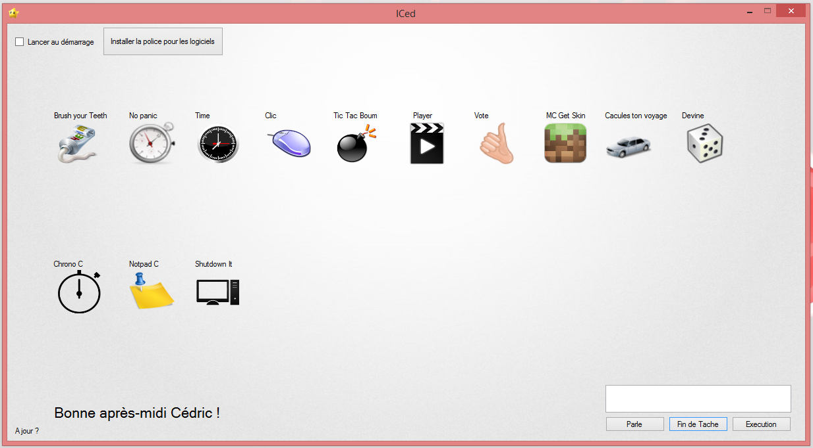

ICed
====
[Site](http://cedced19.github.io)

[Téléchargement](https://raw.githubusercontent.com/cedced19/iced/master/setup/iced-setup.exe)

ICed est un logiciel crée par cedced19 qui permet tous et rien !
Il est avant tout GRATUIT.Il y a un système de verification de nouvelle version.

====
Il contient :

**Notepad C :**

C'est un bloc-note.

**Player :**

Un player de vidéos/musiques.

**Chrono C :**

C'est un chronomètre car il y en a pas par default dans Windows !

**Calcules ton voyage :**

Calculer votre voyage en fonction de la consommation de votre voiture et du prix de l'essence.

**Time C :**

Affiche l'heure.

**Brush your Teeth :**

Tous est dans le nom.Il offre un conte à rebours de trois minutes pour se brosser les dents.

**Shutdown It :**

Vous pouvez éteindre votre pc quand le téléchargement est fini !

**Cliqueur :**

Permet de cliquer beaucoup de fois à la seconde.

**Tic Tac Boum :**

Inspire du jeu de société Tic Tac Boum, trouve des mot avant l'explosion ,ce joue jusqu'à 4 joueurs.

**No panic :**

Inspire du jeu de société No panic, trouve des mots selon un thème ,ce joue jusqu'à 4 joueurs.

**MC Get Skin :**

Permet d'obtenir des skins minecraft à l'aide d'un pseudo.

Et bien d'autres!

====

[Download](https://raw.githubusercontent.com/cedced19/iced/master/setup/iced-setup.exe)

## License
[CC BY-SA](http://creativecommons.org/licenses/by-sa/4.0/)
